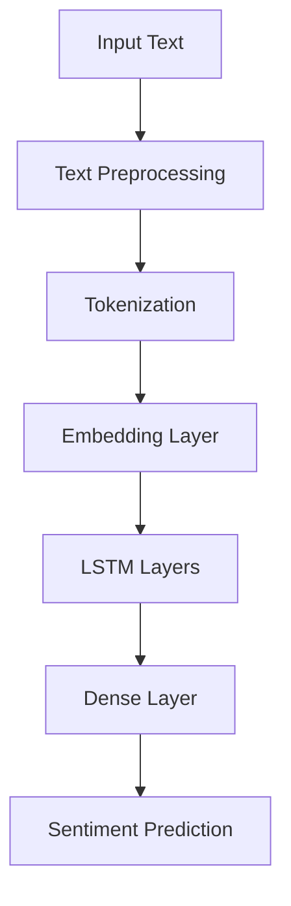

# Movie Review Sentiment Analyzer


## 📝 Overview

A Streamlit web application that analyzes sentiment in movie reviews using an LSTM deep learning model. The app classifies reviews as **positive** or **negative** with confidence scores.

## ✨ Features

- **Accurate Predictions**: ~86.7% accuracy on test data
- **Real-time Analysis**: Get instant sentiment results
- **Detailed Processing**:
  - HTML tag removal
  - Special character cleaning
  - Lemmatization
  - Stopword removal
- **Beautiful UI**: Clean, responsive interface
- **Cloud Ready**: Easy deployment to Streamlit Cloud

## 🛠️ Technical Details

### Model Architecture


**Key Specifications**:
- **Model Type**: LSTM Neural Network
- **Training Data**: IMDB Movie Reviews (50,000 samples)
- **Hosting**: Model hosted on [Hugging Face Hub](https://huggingface.co/HamzaNawaz17/MovieSentimentAnalyzer)
- **Text Length**: Processes up to 200 tokens per review

## 🚀 Deployment

### Local Installation

1. Clone the repository:
   ```bash
   git clone https://github.com/yourusername/movie-sentiment-analyzer.git
   cd movie-sentiment-analyzer
   ```

2. Set up virtual environment:
   ```bash
   python -m venv venv
   source venv/bin/activate  # On Windows: venv\Scripts\activate
   ```

3. Install dependencies:
   ```bash
   pip install -r requirements.txt
   ```

4. Run the application:
   ```bash
   streamlit run app.py
   ```

### Cloud Deployment (Streamlit Cloud)

1. Push your code to a GitHub repository
2. Go to [Streamlit Cloud](https://streamlit.io/cloud)
3. Click "New app" and connect your repository
4. Set configuration:
   - **Repository**: your-repo-name
   - **Branch**: main
   - **Main file path**: app.py
5. Click "Deploy"

## 📂 File Structure

```
movie-sentiment-analyzer/
├── app.py                # Main application file
├── requirements.txt      # Python dependencies
├── README.md             # This documentation
└── .streamlit/           # Streamlit configuration
    └── config.toml       # App theming configuration
```

## 🔍 How It Works

1. **Text Input**: User enters a movie review
2. **Preprocessing**:
   ```python
   def clean_text(text):
       text = re.sub(r'<.*?>', '', text)          # Remove HTML tags
       text = re.sub(r'[^a-zA-Z\s]', '', text)    # Remove special chars
       text = text.lower()                        # Convert to lowercase
       words = [lemmatizer.lemmatize(word) for word in words if word not in stop_words]
       return ' '.join(words)
   ```
3. **Prediction**: LSTM model analyzes processed text
4. **Results Display**: Shows sentiment with confidence percentage

## 🛠 Troubleshooting

| Issue | Solution |
|-------|----------|
| NLTK download errors | App includes automatic handling |
| Model loading issues | Check internet connection |
| Dependency conflicts | Use exact versions in requirements.txt |

## 🤝 Contributing

We welcome contributions! Please follow these steps:

1. Fork the project
2. Create your feature branch (`git checkout -b feature/AmazingFeature`)
3. Commit your changes (`git commit -m 'Add some AmazingFeature'`)
4. Push to the branch (`git push origin feature/AmazingFeature`)
5. Open a Pull Request

## 📜 License

Distributed under the MIT License. See `LICENSE` for more information.

## 📧 Contact

Hamza Nawaz - [@hamzanawazsangha](https://github.com/hamzanawazsangha)

Project Link: [https://github.com/hamzanawazsangha/movie-sentiment-analyzer](https://github.com/hamzanawazsangha/Movie-Sentiment-Analyzer)
